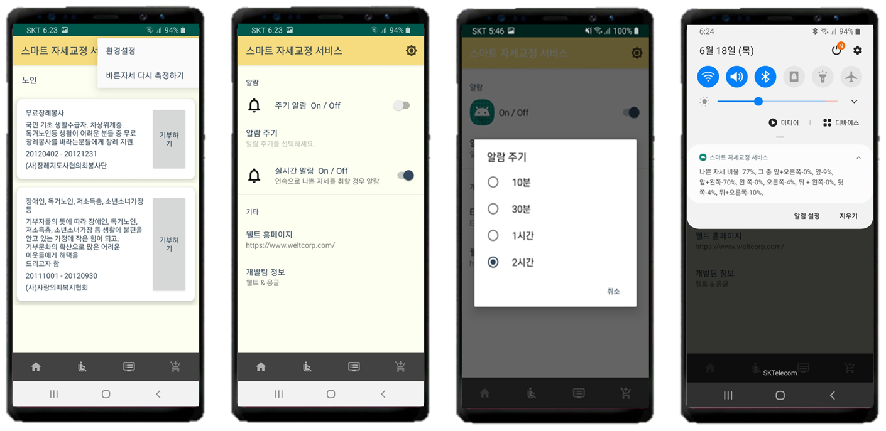

# 웰트·옹글 프로젝트 “요트”

웰트사와 협력하여 웰트사의 벨트를 착용하고 블루투스를 연결하여 현재 자세와
일정 기간의 자세 통계, 그래프를 확인하고 실시간으로 자세를 감지하여 알람을 받을 수 있습니다.

## 프로젝트 목적

- 사용자 맞춤형 자세 교정 서비스를 제공
- 피드백 기능 및 모니터링 기능을 통해 지속적인 자세 교정이 가능하도록 함
- 사용자의 관심과 흥미를 유발해 꾸준한 사용이 가능하도록 함
- 사용자 행동 변화의 불필요로 일상 생활 속 편리함을 추구

# 결과

## 인트로를 통한 자세 맞춤 설정

## 현재 자세와 추천 영상목록

## 알람 설정

## 그래프 보기

### 웰트 홈페이지

https://www.weltcorp.com/
